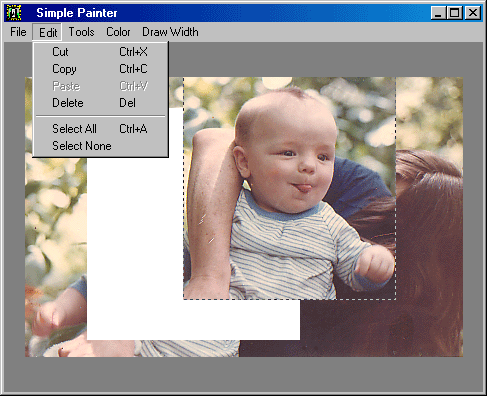



## Simple Painter

### Description

This demo shows in the simplest possible code, the basics of image editing. It is intended for the novice but others may find it useful in optimising or simplifying their code. Whilst it is in no way a full blown editor, it may provide

a basis from which to learn.

If you want an example of a more advanced image editor I suggest you look at "Bobo Image Workshop" which is found at: http://www.planetsourcecode.com/vb/scripts/ShowCode.asp?txtCodeId=21482&lngWId=1
 
### More Info
 

             |
---                |---
**Submitted On**   |2002-05-26 06:03:04
**By**             |[MrBobo](https://github.com/Planet-Source-Code/PSCIndex/blob/master/ByAuthor/mrbobo.md)
**Level**          |Beginner
**User Rating**    |4.8 (19 globes from 4 users)
**Compatibility**  |VB 6\.0
**Category**       |[Graphics](https://github.com/Planet-Source-Code/PSCIndex/blob/master/ByCategory/graphics__1-46.md)
**World**          |[Visual Basic](https://github.com/Planet-Source-Code/PSCIndex/blob/master/ByWorld/visual-basic.md)
**Archive File**   |[Simple\_Pai869145252002\.zip](https://github.com/Planet-Source-Code/mrbobo-simple-painter__1-35089/archive/master.zip)

